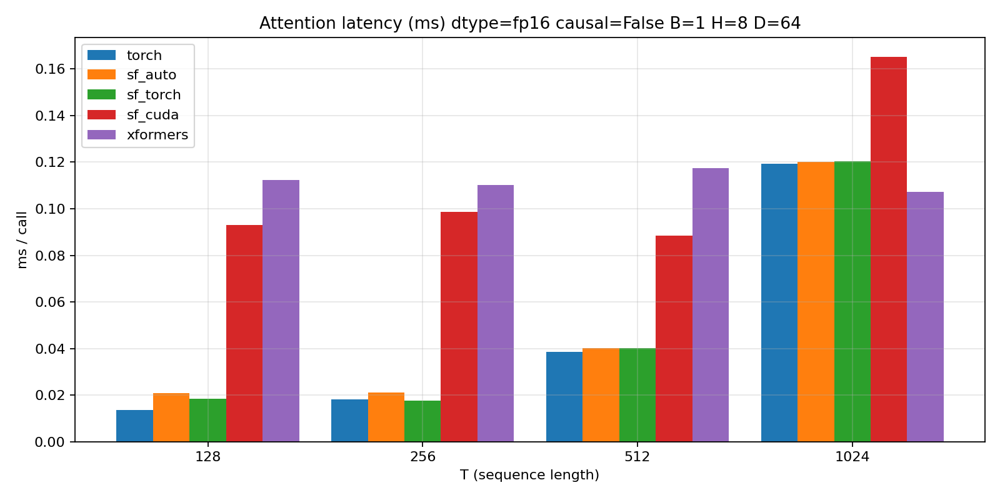
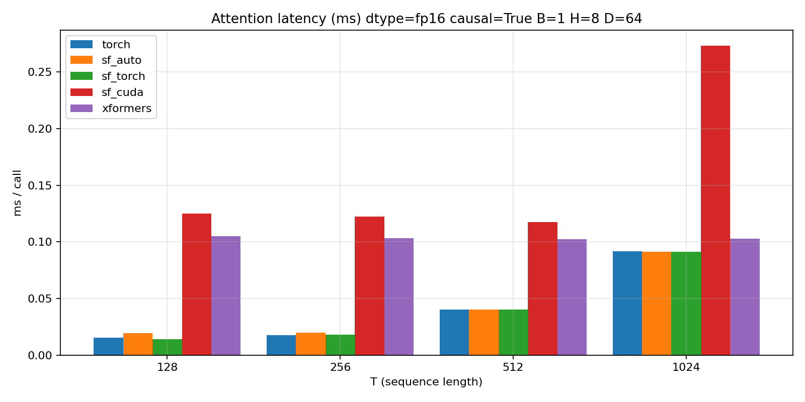

# SynapseFast

High-performance **ML ops for Python** with a clean API and pragmatic speed strategy:

- **Fast by default**: `backend="auto"` uses **PyTorch SDPA** unless you enable autotune or explicitly request custom CUDA.
- **Optional custom kernels**: C++/CUDA extension (runtime-compiled) for experimentation and niche wins.
- **Planner architecture**: Rust (PyO3) module for backend planning/dispatch (extensible, future autotune hooks).
- **Benchmarks + training**: reproducible benchmark scripts + a minimal ToyGPT training loop.

## What you get

- **Attention**: causal + non-causal (`B,H,T,D` layout)
- **KV cache**: prefill + decode helpers (CPU reference + optional CUDA)
- **Norms/activations**: RMSNorm, LayerNorm, GELU
- **Sklearn-like utilities**: `StandardScaler`, `Pipeline`, small tabular models
- **Optional integrations**: HuggingFace, spaCy, OpenCV, LightGBM, CatBoost (installed via extras)

## Install

Editable dev install:

```bash
pip install -e .
```

Install optional extras:

```bash
pip install -e ".[dev]"
pip install -e ".[data,sklearn]"
pip install -e ".[xgb]"
pip install -e ".[lightgbm,catboost]"
pip install -e ".[nlp,spacy]"
pip install -e ".[cv]"
```

### CUDA extension notes (Windows)

The CUDA extension is compiled at runtime when needed. On Windows this requires MSVC (`cl.exe`).
If you don’t want to open a VS Developer Prompt manually:

```powershell
.\scripts\run_with_msvc.ps1 python -c "import synapsefast._cuda_ops as co; print(co.cuda_ext_loaded())"
```

## Quickstart

```python
import torch
import synapsefast as sf

B, H, T, D = 2, 8, 128, 64
q = torch.randn(B, H, T, D, device="cuda", dtype=torch.float16)
k = torch.randn(B, H, T, D, device="cuda", dtype=torch.float16)
v = torch.randn(B, H, T, D, device="cuda", dtype=torch.float16)

out = sf.attention(q, k, v, causal=False)  # backend="auto" by default
```

Backend control:

```python
out = sf.attention(q, k, v, causal=False, backend="torch")  # force PyTorch SDPA
out = sf.attention(q, k, v, causal=False, backend="cuda")   # try custom CUDA kernels (if available)
```

## Benchmarks

Benchmarks are **CUDA-event timed** for accuracy and live in `bench/`.

Run a compare sweep (and write JSON for plotting):

```bash
python bench/compare_attention.py --dtype fp16 --B 1 --H 8 --D 64 --T_list 128,256,512,1024 --json_out docs/benchmarks/compare_noncausal.json
python bench/compare_attention.py --dtype fp16 --causal --B 1 --H 8 --D 64 --T_list 128,256,512,1024 --json_out docs/benchmarks/compare_causal.json
```

Generate plots:

```bash
python bench/plot_attention_results.py --in_json docs/benchmarks/compare_noncausal.json --out_png docs/benchmarks/compare_noncausal_bar.png --kind bar
python bench/plot_attention_results.py --in_json docs/benchmarks/compare_causal.json --out_png docs/benchmarks/compare_causal_bar.png --kind bar
```

### Latest results (this repo)

**Non-causal attention**



**Causal attention**



### Autotune mode (max speed)

When enabled, SynapseFast will benchmark available backends (Torch / CUDA / xFormers if installed) and cache the best per shape/GPU:

```powershell
$env:SYNAPSEFAST_AUTOTUNE="1"
python bench/autotune_attention.py --dtype fp16 --B 1 --H 8 --D 64 --T_list 128,256,512,1024
```

Notes:
- `backend="auto"` defaults to **PyTorch SDPA** unless autotune is enabled.
- To force custom CUDA attention, use `backend="cuda"` or set:

```powershell
$env:SYNAPSEFAST_FORCE_CUSTOM_CUDA="1"
```

## Training example (ToyGPT)

```bat
set SYNAPSEFAST_USE_CUSTOM_CUDA=1
python examples/train_toy_gpt.py --device cuda --dtype fp16 --seq_len 128 --batch_size 4 --steps 50
```

Resume from a checkpoint:

```bat
python examples/train_toy_gpt.py --device cuda --dtype fp16 --resume runs\<your_run>\ckpt_step_00000050.pt
```

## Tests

```bash
pytest -q
```

CUDA-kernel tests are skipped automatically when the extension can’t be built/loaded.

## Project structure

- `synapsefast/`: Python API (fallback-first, user-facing)
- `crates/synapsefast-planner/`: Rust planner module (PyO3)
- `csrc/synapsefast_cuda/`: C++/CUDA extension sources
- `bench/`: benchmarks + plotting utilities
- `examples/`: ToyGPT + classic ML + optional integration demos

## Roadmap (high-signal)

- KV-cache autotune (decode/prefill), where wins are often larger than prefill attention
- More kernel variants (FlashAttention-like), shape specialization, and better heuristics
- A small CI workflow to run CPU tests + formatting/lint on PRs
